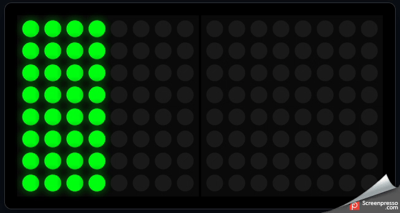
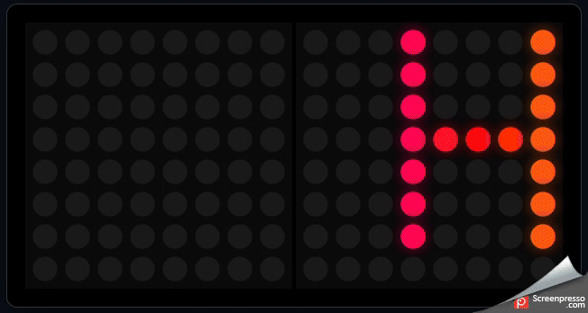
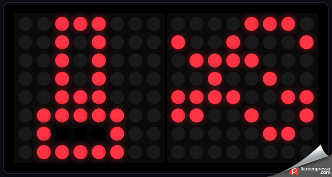
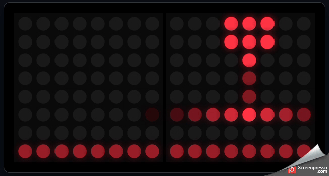
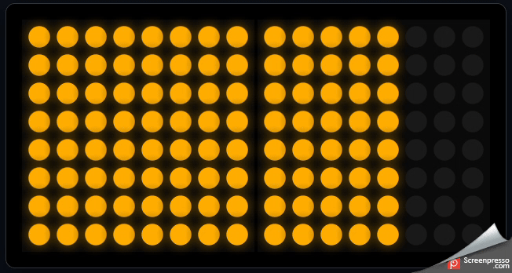

# lumehead

[](https://github.com/celloza/lumehead/actions/workflows/firmware-release.yml)

<a href="https://www.buymeacoffee.com/celloza" target="_blank"></a>

https://github.com/user-attachments/assets/20419a4e-de41-460f-8eeb-57437fe6973f

A 16×8 addressable LED matrix display for 3D printer toolheads — driven by an
ESP32-S3 (or any Klipper-supported MCU), with a browser-based simulator for
authoring animations before flashing them to hardware.

The physical display is two chained Waveshare 8×8 RGB panels (128× WS2812)
mounted on the toolhead, showing live status: hotend temperature, print
progress, leveling/homing, and customizable scrolling text.

## Repository layout

| Path | Description |
| --- | --- |
| [simulator/index.html](simulator/index.html) | Self-contained web simulator. Open in any modern browser — no build step. |
| [klipper/](klipper/) | Klipper `extras` plugin that drives the real hardware over WS2812. |
| [klipper/led_matrix_display.py](klipper/led_matrix_display.py) | The Klipper plugin module. |
| [klipper/README.md](klipper/README.md) | Plugin install & configuration guide. |
| [firmware/](firmware/) | Standalone ESP32-S3 firmware (PlatformIO) for running the display without Klipper, or as a smart I2C peripheral. |
| [docs/](docs/) | Guides — adding new hardware, authoring animations. |

## Features

- **16×8 logical frame** (two 8×8 panels with a coordinate mapper handling
  per-panel indexing and optional serpentine wiring).
- **Visualizations** — all share the same frame-buffer + sprite primitives
  between the simulator and the Klipper plugin so behaviour stays in sync:

  | Animation | Preview |
  | --- | --- |
  | **Progress bar** — left-to-right fill with flashing leading edge |  |
  | **Marquee** — 5×7 dot-matrix font with auto-trimmed glyph spacing |  |
  | **Heating** — thermometer + animated heat waves |  |
  | **Printing** — sweeping print head |  |
  | **Leveling** — used when running auto-bed levelling |  |

  Plus **static text** (centred, up to 3 chars — e.g. `210`, `L42`, `72°F`)
  and a full-frame **pulsing box** (sine brightness pulse).
- **Color overlay engine** — solid HEX or spatial rainbow
  (`Hue = (x*10 + t) mod 360`).
- **5×7 font** including digits, A–Z, common punctuation, and a degree glyph
  (`°`, also accessible as a backtick alias for easy g-code typing).

## Quick start — simulator

```sh
# Just open it
start simulator/index.html        # Windows
xdg-open simulator/index.html     # Linux
open simulator/index.html         # macOS
```

Use the dropdown to switch visualizations, the toggle for rainbow vs. solid
colour, the slider for animation speed, and the text input for the marquee
or static text.

## Quick start — Klipper

See [klipper/README.md](klipper/README.md) for the full guide.
TL;DR:

1. Copy `klipper/led_matrix_display.py` into
   `~/klipper/klippy/extras/led_matrix_display.py`.
2. Add a `[neopixel matrix]` chain (128 LEDs) plus a
   `[led_matrix_display]` section to your `printer.cfg`.
3. Restart Klipper. Drive it from the console or macros:

```gcode
MATRIX_SHOW MODE=marquee TEXT="HELLO"
MATRIX_SHOW MODE=progress VALUE=0.42
MATRIX_SET  COLOR=#00ff88 RAINBOW=0 BRIGHTNESS=0.4 SPEED=40
MATRIX_TEXT TEXT="72`F"          # backtick is rendered as the degree glyph
```

With `auto_mode: true`, the plugin switches modes automatically based on
Klipper events (printing, homing, idle).

## Hardware

- 2× Waveshare RGB-Matrix-P3-64 (or any WS2812-based 8×8 panel) chained
  `DOUT` → `DIN`.
- 5 V supply sized for ~7.7 A peak (128 LEDs × 60 mA all-white). In practice
  global brightness scaling keeps draw far below this.
- A 3.3 V → 5 V level shifter on the data line is recommended.
- Any Klipper MCU with a free GPIO. ESP32-S3 is a natural fit if you want to
  run animations standalone in the future.

## Porting visualizations

The drawing primitives in `simulator/index.html` (`setPixel`, `drawGlyph`,
`drawSprite`, `getColor`, `mapCoord`, `FONT5x7`) intentionally mirror the
Python equivalents in `led_matrix_display.py` 1:1.

See [docs/creating-animations.md](docs/creating-animations.md) for a full
walkthrough of authoring a new animation in the simulator and porting it to
the Klipper plugin and ESP32-S3 firmware.

## Adding new hardware

The ESP32-S3 firmware is structured to support multiple board variants. See
[docs/adding-hardware.md](docs/adding-hardware.md) for how to register a new
board, configure pin assignments, and have CI build release binaries for it.

## License

See [LICENSE](LICENSE).
